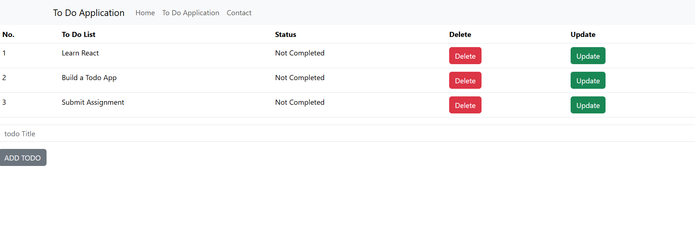
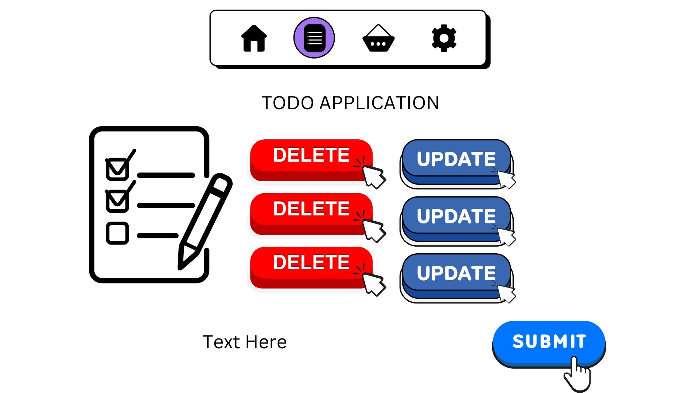

# Todo Application Project 3

# Overview:

A Webpage with different characteristics such as a todo list, contact form, and home page. Which involves keeping track of your todo's giving the feature of adding or deleting todos in a list along with a contact form!

# Screenshot:

# Technologies used:

    - React
    - JavaScript
    - CSS
    - Bootstrap

# User Stories:

    - As a user I want to add things to a list todo.
    - As a user I want to contact someone if there is a problem.
    - As a user I want to be able to navigate between different pages.

# Wireframe:

# Next Steps:

    - Add some color/styles to the pages
    - Assign check marks for completed items on list
    - Add backgrounds to pages

# Author

[Chandler Grajeda](https://www.linkedin.com/in/chandler-grajeda-57289a292/)